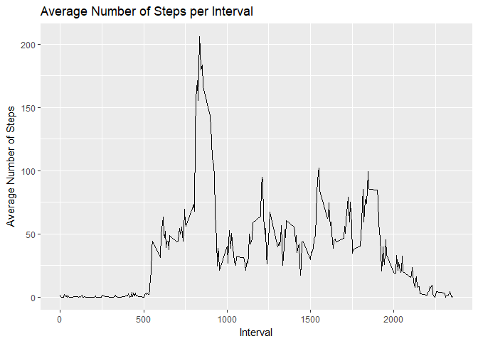
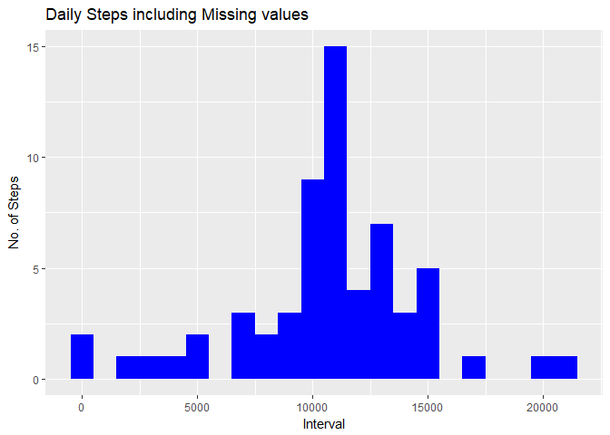
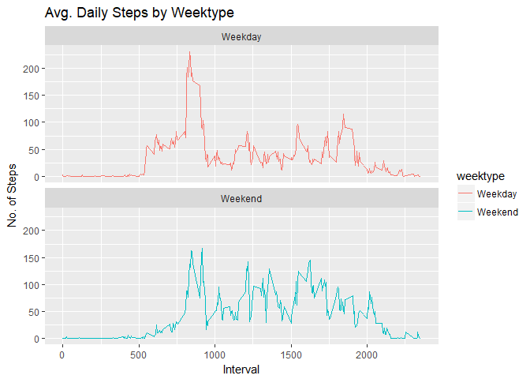

## Loading and preprocessing the data

```r
library(ggplot2)
library(plyr)
library(dplyr)
```

```r
setwd("D:/Test/Coursera/DataScience/RepData_PeerAssessment1")
activity<- read.csv("activity.csv", header = T, sep = ",")
activity$day <- weekdays(as.Date(activity$date))
summary(activity)
```

```
##      steps                date          interval          day           
##  Min.   :  0.00   2012-10-01:  288   Min.   :   0.0   Length:17568      
##  1st Qu.:  0.00   2012-10-02:  288   1st Qu.: 588.8   Class :character  
##  Median :  0.00   2012-10-03:  288   Median :1177.5   Mode  :character  
##  Mean   : 37.38   2012-10-04:  288   Mean   :1177.5                     
##  3rd Qu.: 12.00   2012-10-05:  288   3rd Qu.:1766.2                     
##  Max.   :806.00   2012-10-06:  288   Max.   :2355.0                     
##  NA's   :2304     (Other)   :15840
```

###What is mean total number of steps taken per day?  

```r
attach(activity)
aggdata <- aggregate(activity$steps ~ activity$date, FUN=sum, na.rm=T)
detach(activity)
colnames(aggdata)<- c("Date", "Steps")
```

###Drawing Histogram and calculating mean and median

```r
hist(aggdata$Steps, breaks=5, xlab="Steps", main = "Total Steps per Day")
```

<!-- -->

```r
sprintf("The average number of steps taken each day is %i steps", as.integer(mean(aggdata$Steps)))
```

```
## [1] "The average number of steps taken each day is 10766 steps"
```

```r
sprintf("The median number of steps taken each day is %i steps", as.integer(median(aggdata$Steps)))
```

```
## [1] "The median number of steps taken each day is 10765 steps"
```

###What is the average daily activity pattern?

```r
#pulling data without nas
cleandata <- activity[!is.na(activity$steps),]
#creating average number of steps per interval
intTable <- ddply(cleandata, .(interval), summarize, Avg = mean(steps))
#Create line plot of average number of steps per interval
p <- ggplot(intTable, aes(x=interval, y=Avg))
p + geom_line()+xlab("Interval")+ylab("Average Number of Steps")+ggtitle("Average Number of Steps per Interval")
```

<!-- -->

```r
#Maximum steps by interval
maxSteps <- max(intTable$Avg)
#Which interval contains the maximum average number of steps
intTable[intTable$Avg==maxSteps,1]
```

```
## [1] 835
```

###Imputing missing values

```r
#Calculate and report the total number of missing values in the dataset (i.e. the total number of rows with NAs)
countcleandata <- nrow(activity[is.na(activity$steps),])
print(countcleandata)
```

```
## [1] 2304
```

```r
#Create the average number of steps per weekday and interval
activitydata2<- activity
nas<- is.na(activitydata2$steps)
avg_interval<- tapply(activitydata2$steps, activitydata2$interval, mean, na.rm=TRUE, simplify = TRUE)
activitydata2$steps[nas] <- avg_interval[as.character(activitydata2$interval[nas])]
names(activitydata2)
```

```
## [1] "steps"    "date"     "interval" "day"
```

```r
#Reorder columns (for better understanding of the data):
activitydata2<- activitydata2[, c("date", "interval", "steps")]
head(activitydata2)
```

```
##         date interval     steps
## 1 2012-10-01        0 1.7169811
## 2 2012-10-01        5 0.3396226
## 3 2012-10-01       10 0.1320755
## 4 2012-10-01       15 0.1509434
## 5 2012-10-01       20 0.0754717
## 6 2012-10-01       25 2.0943396
```

```r
#Make a histogram of the total number of steps taken each day
detach(package:plyr)
Total_Steps2<- activitydata2%>%
group_by(date)%>%
summarise(total_steps = sum(steps, na.rm=TRUE))
Total_Steps2
```

```
## # A tibble: 61 x 2
##          date total_steps
##        <fctr>       <dbl>
##  1 2012-10-01    10766.19
##  2 2012-10-02      126.00
##  3 2012-10-03    11352.00
##  4 2012-10-04    12116.00
##  5 2012-10-05    13294.00
##  6 2012-10-06    15420.00
##  7 2012-10-07    11015.00
##  8 2012-10-08    10766.19
##  9 2012-10-09    12811.00
## 10 2012-10-10     9900.00
## # ... with 51 more rows
```

```r
ggplot(Total_Steps2, aes(x = total_steps)) +
geom_histogram(fill = "blue", binwidth = 1000) +
labs(title = "Daily Steps including Missing values", x = "Interval", y = "No. of Steps")
```

<!-- -->

```r
sprintf("The average number of steps taken each day is %g steps", as.double(mean(Total_Steps2$total_steps)))
```

```
## [1] "The average number of steps taken each day is 10766.2 steps"
```

```r
sprintf("The median number of steps taken each day is %g steps", as.double(median(Total_Steps2$total_steps)))  
```

```
## [1] "The median number of steps taken each day is 10766.2 steps"
```

###Are there differences in activity patterns between weekdays and weekends?

```r
#Create a new factor variable in the dataset with two levels – “weekday” and “weekend”
activitydata3<-activitydata2
activitydata3$day <- weekdays(as.Date(activitydata3$date))
activitydata3$day <- as.factor(activitydata3$day)
activitydata3<- activitydata3 %>%
  mutate(weektype= ifelse(activitydata3$day=="Saturday"|activitydata3$day=="Sunday", "Weekend", "Weekday"))
head(activitydata3)
```

```
##         date interval     steps    day weektype
## 1 2012-10-01        0 1.7169811 Monday  Weekday
## 2 2012-10-01        5 0.3396226 Monday  Weekday
## 3 2012-10-01       10 0.1320755 Monday  Weekday
## 4 2012-10-01       15 0.1509434 Monday  Weekday
## 5 2012-10-01       20 0.0754717 Monday  Weekday
## 6 2012-10-01       25 2.0943396 Monday  Weekday
```

```r
#Make a panel plot containing a time series plot (i.e. type = "l") of the 5-minute interval
newInterval<- activitydata3%>% 
 group_by(interval, weektype)%>%
 summarise(avg_step2<- mean(steps, na.rm = T))
colnames(newInterval)<- c("interval", "weektype", "avg_step2")
head(newInterval)
```

```
## # A tibble: 6 x 3
## # Groups:   interval [3]
##   interval weektype  avg_step2
##      <int>    <chr>      <dbl>
## 1        0  Weekday 2.25115304
## 2        0  Weekend 0.21462264
## 3        5  Weekday 0.44528302
## 4        5  Weekend 0.04245283
## 5       10  Weekday 0.17316562
## 6       10  Weekend 0.01650943
```

```r
plot<- ggplot(newInterval, aes(x =interval , y=avg_step2, color=weektype)) +
geom_line() +
labs(title = "Avg. Daily Steps by Weektype", x = "Interval", y = "No. of Steps") +
facet_wrap(~weektype, ncol = 1, nrow=2)   
print(plot)
```

<!-- -->
